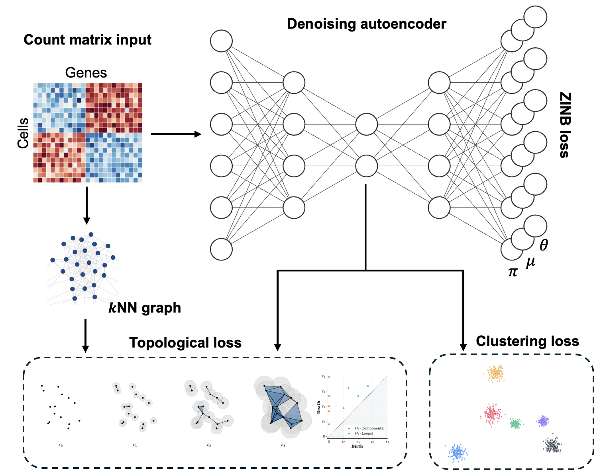

# scTopoDEC 

**Topological deep embedded clustering for single-cell RNA-seq data.**

Clustering remains a challenging task in scRNA-seq analysis despite the development of numerous computational methods. Here, we introduce **scTopoDEC (single-cell topological deep embedded clustering)**, a deep learning-based clustering method that incorporates **persistent homology** to improve clustering performance by preserving topological information in single-cell data.

<p align="center">
  
</p>

## Installation

```bash
pip install git+https://github.com/AugustusKH/scTopoDEC.git
```

## Quick start

scTopoDEC provides two execution options: a command-line interface and a Jupyter Notebook. We require an `.h5ad` file as the input in the model. As scTopoDEC is designed specifically for cell clustering, it processes the input .h5ad file, performs clustering, and writes the predicted cluster labels back to the original file as the output.

### Command line

We run the command line for scTopoDEC as follows:

```bash
scTopoDEC input_file.h5ad \
  --n_clusters 0 \
  --output output_file.h5ad
```

If the exact number of clusters is unknown, set `--n_clusters` to 0. The model will then automatically estimate the optimal number of clusters. The remaining parameters can be configured manually as described below; however, we recommend using the default settings.

| Parameter | Type | Default | Description |
|---|---|---|---|
| `--hidden_size` | `str` | `(256, 32, 256)` | Network architecture as a tuple string |
| `--loss_weights` | `str` | `(1.0, 10.0, 0.1, 1.0)` | Loss weights `(ZINB, Cluster, SoftK, Topo)` as a tuple string |
| `--n_clusters` | `str` | `0` | Number of clusters, if set to 0, will automatically determine optimal number of clusters |
| `--n_top_genes` | `int` | `2000` | Number of highly variable genes used in model training |
| `--noise_sd` | `float` | `0.4` | Standard deviation of Gaussian noise added to input |
| `--hidden_dropout` | `float` | `0.05` | Dropout rate applied to hidden layers (0.0 to 1.0) |
| `--pretrain_epochs` | `int` | `800` | Autoencoder pretraining epochs |
| `--epochs` | `int` | `500` | Max training epochs |
| `--pretrain_lr` | `float` | `1e-3` | Pretraining learning rate |
| `--lr` | `float` | `1e-4` | Learning rate |
| `--update_interval` | `int` | `10` | Epochs between target distribution updates |
| `--tol` | `float` | `1e-3` | Convergence threshold |
| `--maximum_edge_length` | `float` | `1e-3` | Filtration cutoff when running persistent homology |
| `--topo_size` | `int` | `256` | Number of cells sampled for topological loss calculation |
| `--order` | `float` | `1.0` | Wasserstein exponent q for diagram distance |
| `--k` | `int` | `100` | Nearest neighbors for graph construction |